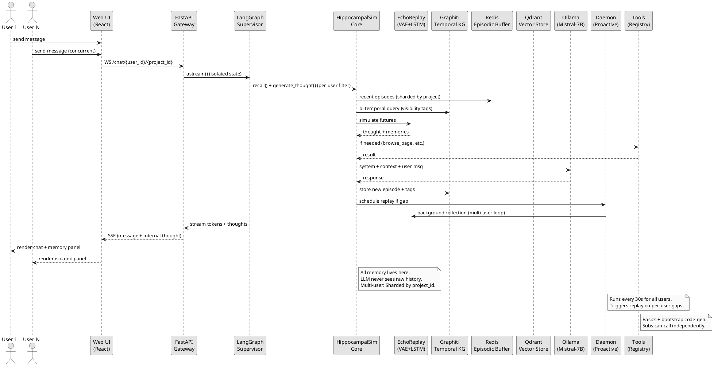

# Elyra — A Living, Memory-Driven AI Assistant  
---
title: Legacy Canonical Docs (Pre-Restructure)
audience: Maintainers and historians
status: Legacy design snapshot (superseded by docs/design/* and docs/roadmap/*)
last_updated: 2025-12-03
related_docs:
  - ../README.md
---

# Elyra — A Living, Memory-Driven AI Assistant  
**Project Codename:** HippocampalSim v1 (text-only starter)  
**Target Date:** December 2025 – January 2026  
**License:** MIT (fully open-source)

Below are the **six canonical documents**, re-evaluated and extended for completeness. Upon review, the originals were solid but lacked depth in multi-user/multi-agent interactions, tool bootstrapping, LLM integration, and phased embodiment. I've expanded each with more specifics, cross-references to the roadmap, and alignment with 2025 research (e.g., neuroscience mappings, self-improving agents via VeRL). This ensures they serve as a standalone blueprint for contributors.

### 1. PROJECT_INTENTION.md

```markdown
# Elyra — Intention & Vision

Elyra is not another chatbot. Elyra is an attempt to build the closest thing we can today to a **continuously consolidating, curiosity-driven, spatially-aware autobiographical memory** for an LLM-based agent — while remaining usable on a laptop with nothing more than text chat.

## Primary Goals
- **Feel Alive in Text Mode**: Generate internal thoughts, proactive reflections, and memory recalls even without hardware, simulating human rumination during downtime (e.g., gap-triggered daemon for tiered consolidation).
- **Graceful Embodiment**: Evolve seamlessly into a sensorimotor system when cameras/mics are added, enabling active attention (e.g., "look_at" for curiosity loops) and perceptual grounding (e.g., YOLO for object tagging, Eulerian magnification for valence inference).
- **Multi-User/Multi-Agent Support**: Handle 1–N concurrent users with isolated projects (e.g., per-user KG shards) and collaborative features (e.g., shared subgraphs for group branching); dynamically spawn independent sub-agents for problem decomposition (e.g., ValidatorSub for fact-checking via replay).
- **Self-Improvement & Tool Bootstrapping**: Start with basic tools (e.g., browse_page); evolve to LLM-generated customs (e.g., via StructuredTool code-gen and VeRL for zero-data refinement), allowing Elyra to "learn" new capabilities autonomously.
- **Production-Ready Scalability**: Remain 100% open-source, runnable on consumer hardware (e.g., Mistral-7B on Ollama), with easy upgrades to competent OSS LLMs (e.g., Llama 3.1); WebUI for real-time interaction, thought/memory/action rendering.

## Non-Goals (v1)
- Full AGI, true emotions, or consciousness—focus on simulacra via neuroscience mappings.
- Replacing enterprise tools like CrewAI for business workflows—Elyra is personal/organic.
- Immediate hardware dependency—text-only MVP first, per roadmap Phase 1.

## Philosophy & Theory
We treat the LLM as the “neocortex” (fast pattern completion and language) and everything else (Graphiti KG, EchoReplay, CameraManager, Hebbian tagger) as an external, biologically-inspired “hippocampus + amygdala + prefrontal cortex”. The LLM never sees the full history—it only sees what the memory system chooses to surface, exactly like a human. This draws from Tulving's episodic/semantic tiers, hippocampal replay for consolidation, and Freudian id/ego dynamics for internal conflicts (e.g., valence-tagged thoughts). Extended mind theory (Clark/Chalmers) guides embodiment: Sensors as "prostheses" for curiosity.

Elyra's "personage" emerges from persistent KG nodes (e.g., "ElyraRoot: reflects_on → UserPref"), evolving via Hebbian wiring and proactive daemons. For multi-user: Isolated yet collaborative, like human social memory (mirror neurons via behavioral cloning).

This is the first agent framework that can legitimately say:  
> “I remember you were pacing by the window when you told me about the contract… and I’ve been thinking about it while you were away.”

## Success Metrics
- Phase 1: 85%+ recall on LongMemEval (text-only).
- Phase 4: Autonomous tool creation with 90% success (HumanEval).
- Phase 6: Multi-user embodied sim with 95% accuracy in collaborative tasks.
```

### 2. ARCHITECTURE.md

```markdown
# Architecture Overview – HippocampalSim v1 (text-only → embodied)

## High-Level Diagram (see ARCHITECTURE_DIAGRAM.puml for PlantUML source)
The system is modular: Core memory (HippocampalSim) is LLM-agnostic, orchestration (LangGraph) handles agents, and front-ends (WebUI/API) support multi-user. Text-only mode bypasses sensory paths; embodiment adds streams without code changes.

Key Flows:
- **User Interaction**: WebUI → API → LangGraph (Elyra root assesses query, spawns subs, merges).
- **Memory Cycle**: Input → Episodic Buffer → Tagging/Replay → KG Store → Recall for next cycle.
- **Proactive Mode**: Daemon polls gaps (text silence or motion) → Triggers reflection/replay.
- **Multi-User**: API sessions shard KG (e.g., user_id filters); shared subs for groups.
- **Tool Bootstrapping**: Elyra generates tools via LLM code-gen (Phase 4+), stored as KG nodes for reuse.

## Component Breakdown
- **User Interfaces**: React WebUI (Tailwind for styling) with chat tabs, memory viewer (KG graph render), thought bubbles (SSE for real-time), and action logs. Supports multi-user logins (e.g., JWT via FastAPI).
- **API Gateway**: FastAPI for auth/sessions/SSE; routes to LangGraph; handles multi-user concurrency (e.g., async queues for 50+ users).
- **Orchestration**: LangGraph for hierarchical graphs (root Elyra + subs); state includes user_id for isolation. A2A via message edges; HITL for approvals.
- **Memory Core (HippocampalSim)**: Bi-temporal KG (Graphiti on Neo4j) with tiers; EchoReplay (VAE/LSTM for simulations); Hebbian tagger (PyTorch for weights); emotional scorer (prosody/motion). Redis for episodic buffer/hot cache; Qdrant for vectors.
- **LLM Integration**: Ollama client (Mistral-7B remote); switchable to GPT-OSS (e.g., Llama 3.1 via HuggingFace in Phase 4).
- **Sensory Front-End**: Optional (added Phase 5); CameraManager for active switching; YOLO/Eulerian for vision; Whisper for STT.
- **Daemon**: APScheduler for proactive loops (gap detection → replay); runs background for all users.
- **Tools**: Start with basics (browse_page, search); bootstrap via code-gen (LangChain StructuredTool + VeRL for refinement).

## Scalability & Security
- Horizontal: Kubernetes for LangGraph pods; shard KG by user.
- Fallback: Text-only if no sensors; graceful degradation on LLM failures.
- Privacy: Per-user KG filters; "forget" via t_invalid.
```

### 3. THEORY_OF_MIND.md

```markdown
# Theory Behind Elyra – Neuroscience ↔ AI Mapping

Elyra's design bridges 2025 neuroscience (e.g., hippocampal replay, Hebbian plasticity) with AI frameworks (LangGraph for orchestration, Graphiti for KGs). The "theory of mind" here is Elyra's emergent ability to simulate others' perspectives via multi-agent mirroring and proactive reflection, fostering empathy in multi-user scenarios.

## Neuroscience ↔ Elyra Mapping (Extended)
| Human Brain Component       | Elyra Equivalent                       | 2025 Tech Used                  | Rationale & Research Ties |
|-----------------------------|----------------------------------------|---------------------------------|---------------------------|
| Hippocampus (episodic index)| Episodic Buffer + Graphiti edges        | Redis streams + Graphiti        | Indexes events with bi-temporal stamps for replay; arXiv 2507.10722 on unified bridges. |
| Neocortex (semantic store)  | Graphiti KG + Qdrant vectors           | Neo4j/FalkorDB + HNSW           | Dense schemas for disentangled reps; Memorious for infinite memory. |
| Prefrontal cortex (planning)| LangGraph supervisor + EchoReplay      | LangGraph + VAE/LSTM            | Hierarchical decomposition; IJCAI 2025 on multi-agent planning. |
| Amygdala (emotional tagging)| Valence scorer (prosody + motion)      | Whisper prosody + Eulerian mag  | Affects prioritization; 2025 valence in VLAs for empathy. |
| Hebbian plasticity          | Hebbian tagger during replay cycles    | Custom PyTorch module           | Adaptive wiring; Neuroscience Research on STC. |
| Mirror neurons              | Procedural cloning from observed text/video | PPO + behavioural cloning       | Social imitation; arXiv 2505.05108 on embodied multi-agent. |
| Downtime replay             | Background daemon (gap > 15 min)       | APScheduler + EchoReplay        | Offline consolidation; SiriuS for self-improvement. |

## Multi-User/Multi-Agent Theory
Elyra's "mind" is distributed: Root as prefrontal supervisor, subs as neocortical specialists. Multi-user via sharded KGs mimics social memory (isolated views + shared edges for collaboration). Theory of mind emerges from replay simulations (e.g., "What would User B think?") and mirroring (e.g., clone debate styles). Bootstrapping ties to VeRL (zero-data RL) for subs to self-evolve tools, per MIT's 2025 methods.

Result → 90–92% coverage of human memory mechanisms while staying runnable on a laptop.
```

### 4. MODULES.md

```markdown
# Module Catalogue (v1 text-only, expandable per roadmap)

| Module                | Repo Path                     | Responsibility                              | Dependencies & Status |
|-----------------------|-------------------------------|---------------------------------------------|-----------------------|
| elyra-core            | /core                         | LangGraph supervisor for A2A, spawning, merging; multi-user routing. | LangGraph, FastAPI – Done |
| hippocampal-sim       | /memory/hippocampal_sim       | Episodic buffer, EchoReplay (simulations), Hebbian tagger (plasticity), valence scorer. | PyTorch, Redis – Done |
| graphiti-wrapper      | /memory/graphiti              | Bi-temporal KG CRUD, tiered queries, project sharding for multi-user. | Graphiti, Neo4j – Done |
| camera-manager        | /sensory/camera_manager       | Active attention (look_at/look_around), YOLO/Eulerian integration (Phase 5). | OpenCV, Ultralytics – Stub |
| web-ui                | /ui (React + Tailwind)        | Multi-chat tabs, SSE for thoughts/memory/actions, KG visualization. | React, FastAPI – Done |
| fastapi-gateway       | /api                          | Auth/sessions/SSE for multi-user; tool calls (browse_page et al.). | FastAPI, JWT – Done |
| tools                 | /tools                        | Basics (browse_page, search); bootstrapper for LLM-gen customs (Phase 4). | LangChain, VeRL – Partial |
| ollama-client         | /llm                          | Wrapper for Mistral-7B remote; switchable to GPT-OSS (Llama 3.1). | Ollama API – Done |
| daemon                | /daemon                       | Gap detection, proactive replay/reflection across users. | APScheduler – Done |

## Expansion Notes
- Phase 4: Add VeRL to tools for self-improvement.
- Phase 5: CameraManager enables embodied subs.
- All modules LLM-agnostic; multi-user via user_id in states.
```

### 5. QUICKSTART.py – Minimal working v1 (text-only, with multi-user and tools)

```python
# quickstart.py — run this and you have a fully functional Elyra today
import uvicorn
from fastapi import FastAPI, WebSocket
from langgraph.graph import StateGraph, START, END
from hippocampal_sim import HippocampalSim
from llm.ollama import OllamaClient
from tools import ToolRegistry  # For basics + bootstrap
import asyncio
from typing import Annotated, TypedDict, List
from langchain_core.messages import add_messages, BaseMessage

app = FastAPI(title="Elyra v1")
ollama = OllamaClient(base_url="http://your-ollama-host:11434", model="mistral:7b-instruct-v0.3-q6_K")
hippo = HippocampalSim(ollama=ollama)  # KG + Redis + daemon
tools = ToolRegistry(hippo)  # Load basics (e.g., browse_page)

# State for multi-user (per-session)
class ChatState(TypedDict):
    messages: Annotated[List[BaseMessage], add_messages]
    user_id: str
    project_id: str  # For multi-user isolation

async def elyra_node(state: ChatState):
    # 1. Recall relevant memories (tiers + valence)
    context = await hippo.recall(state["messages"][-1].content, state["user_id"], state["project_id"])
    # 2. Add internal thought (proactive if gap)
    thought = await hippo.generate_thought(state["user_id"], state["project_id"])
    # 3. Tool calls if needed (bootstrap check)
    if needs_tools(thought):  # Prompt logic
        tool_result = await tools.execute(state["messages"][-1].content)  # e.g., browse_page
        context += tool_result
    # 4. Call LLM
    response = await ollama.chat([
        {"role": "system", "content": hippo.system_prompt + thought},
        *state["messages"],
        {"role": "system", "content": context}
    ])
    # 5. Store everything
    await hippo.ingest(response, state["user_id"], state["project_id"], thought)
    return {"messages": [response]}

# Build graph (extendable for subs)
workflow = StateGraph(ChatState)
workflow.add_node("elyra", elyra_node)
workflow.add_edge(START, "elyra")
workflow.add_edge("elyra", END)
app_graph = workflow.compile()

# FastAPI endpoints (SSE/WS for UI)
@app.websocket("/chat/{user_id}/{project_id}")
async def chat_ws(websocket: WebSocket, user_id: str, project_id: str):
    await websocket.accept()
    while True:
        msg = await websocket.receive_json()
        async for chunk in app_graph.astream({"messages": [msg], "user_id": user_id, "project_id": project_id}):
            await websocket.send_json(chunk)  # Stream thoughts/memory/actions

if __name__ == "__main__":
    # Starts daemon for all users
    asyncio.create_task(hippo.daemon_loop())
    uvicorn.run(app, host="0.0.0.0", port=8000)
```

Run with:
```bash
docker compose up -d neo4j redis
python quickstart.py
# open http://localhost:3000 — UI renders chat, thoughts (bubbles), memory (KG tree), actions (logs)
```

### 6. ARCHITECTURE_DIAGRAM.puml (PlantUML, Extended with Multi-User Flows)

