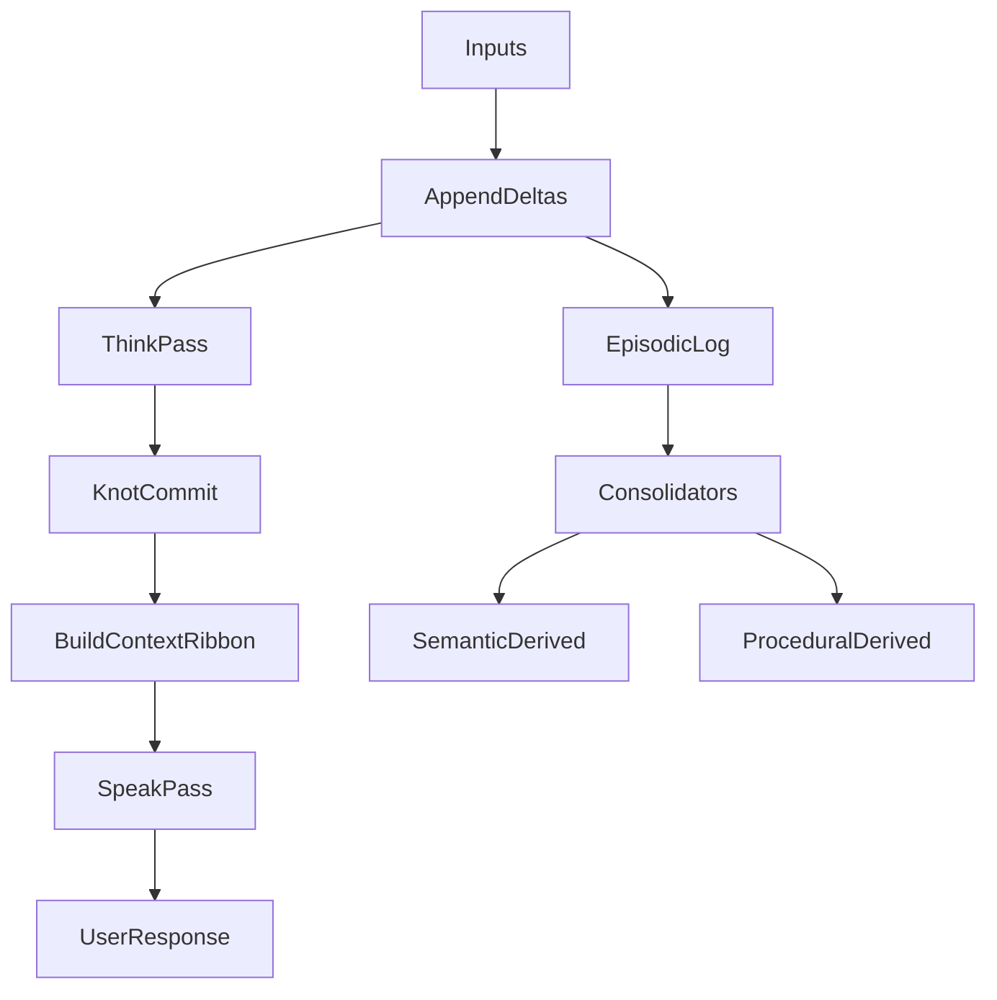

## Overview

Elyra v2 models the system as a **Braid**: an append-only stream of deltas with periodic immutable checkpoints (“knots”), plus overlapping “episodes” that organize knots into narrative/topic/intent groupings. Elyra composes two core subsystems:

- **LargeMemoryModel (LMM)**: episodic/semantic/procedural memory, beads, consolidation, retrieval/ribbon building
- **LargeCognitiveModel (LCM)**: knot processing (think/speak), microagents, tests, fork detection

Elyra itself is the **composition layer**: API/UI + configuration and wiring of LMM and LCM.

## High-level flow

## Key design choices

- **Aliveness over perfection**: continuous background metacognition and thought; dreams produce low-confidence hypotheses.
- **No tool calls in speak**: tool use happens during think-pass.
- **Forks are conservative**: forks are pending-first, confirmed by classifier, and adaptively tuned.
- **Reasoning as beads**: narrative thought summaries are stored, inspectable, and optionally used as context inputs; raw CoT is never included by default.

